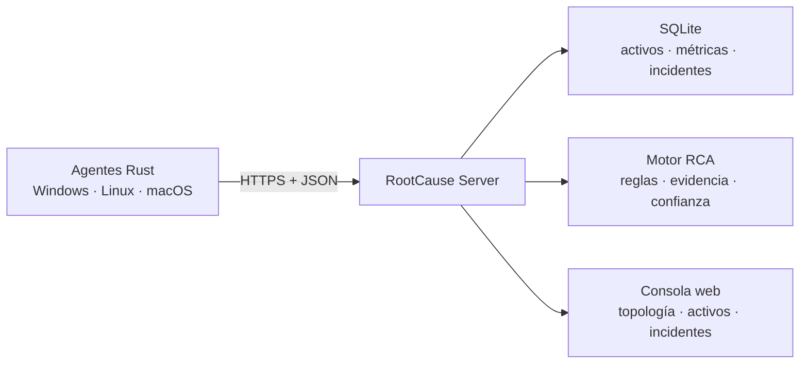

# RootCause Server

**Centro de control multiplataforma para observabilidad, correlación de eventos y
diagnóstico de causa raíz con evidencia.**

RootCause Server reúne en una sola consola el estado de equipos Windows, Linux
y macOS. Un agente Rust de sólo lectura envía telemetría al servidor; el motor
correlaciona señales, crea incidentes reproducibles y propone acciones guiadas.

> Estado: base funcional `0.1.0`. No es todavía una alternativa completa a una
> plataforma empresarial como FortiOS. La matriz [CAPABILITIES.md](docs/CAPABILITIES.md)
> diferencia lo implementado de lo planificado.

## Principios del producto

- **Explicar antes de actuar:** cada diagnóstico conserva causa probable,
  confianza, evidencia y recomendaciones.
- **Rust-first:** servidor y agente son binarios nativos con una consola web
  embebida.
- **Multiplataforma real:** compilación y pruebas en Windows, Linux y macOS.
- **Seguro por defecto:** escucha local, token obligatorio y rechazo de tokens
  sobre HTTP remoto.
- **Complementario:** integra antivirus, EDR, SIEM y firewalls; no los reemplaza.
- **Respuesta controlada:** no ejecuta acciones destructivas automáticamente.

## Qué incluye esta versión

- Registro e inventario de endpoints.
- Recolección de CPU, memoria, disco, red, carga y tiempo activo.
- Persistencia local SQLite con WAL.
- Detección determinista de presión de CPU, memoria y disco.
- Incidentes deduplicados con evidencia, confianza y acciones recomendadas.
- Vista `RootCause Topology` agrupada por sistema operativo.
- API REST versionada y consola responsiva sin dependencias web externas.
- Token bearer, límites de entrada, auditoría de cambios y transporte seguro.
- Plantillas de servicio para Windows, systemd y launchd.
- CI y artefactos para los tres sistemas de escritorio.

## Arquitectura



Consulta [ARCHITECTURE.md](docs/ARCHITECTURE.md) para los límites y la evolución
hacia despliegues distribuidos.

## Inicio rápido

### Requisitos

- Rust `1.95.0` o superior.
- Windows 10/11 o Server moderno, una distribución Linux compatible, o macOS.

### 1. Generar un token

```bash
cargo run -p rootcause-server -- token
```

### 2. Iniciar el servidor

Linux/macOS:

```bash
export ROOTCAUSE_API_TOKEN="pega-aqui-el-token-generado"
cargo run -p rootcause-server -- serve
```

PowerShell:

```powershell
$env:ROOTCAUSE_API_TOKEN = "pega-aqui-el-token-generado"
cargo run -p rootcause-server -- serve
```

Abre `http://127.0.0.1:8080` e ingresa el token en la consola.

### 3. Registrar el equipo local

En otra terminal, usando el mismo token:

```bash
cargo run -p rootcause-agent -- --once
```

Para dejar el agente enviando telemetría cada 30 segundos:

```bash
cargo run -p rootcause-agent -- --label site=hq --label environment=production
```

## Comandos principales

```text
rootcause-server token
rootcause-server serve --bind 127.0.0.1:8080 --database-url sqlite://rootcause.db

rootcause-agent --server-url https://rootcause.example.cl --interval-seconds 30
rootcause-agent --once
```

Las opciones aceptan variables de entorno equivalentes. Revisa `.env.example`.

## Uso remoto seguro

El servidor escucha solamente en `127.0.0.1` por defecto. Para administrar
otros equipos:

1. Sitúa el servidor tras Caddy, Nginx, Traefik o un balanceador con TLS.
2. Usa un certificado confiable y una red privada/VPN cuando corresponda.
3. Cambia `ROOTCAUSE_BIND` únicamente después de proteger la ruta.
4. Instala el agente con una URL `https://`.
5. Rota el token y separa credenciales por organización en una fase posterior.

No expongas directamente el puerto administrativo ni la base SQLite a Internet.

## Desarrollo

```bash
cargo fmt --all -- --check
cargo clippy --workspace --all-targets -- -D warnings
cargo test --workspace
cargo run -p rootcause-server -- serve --insecure-dev-mode
```

El modo inseguro sólo funciona en loopback y existe exclusivamente para
desarrollo local.

## Documentación

- [Arquitectura](docs/ARCHITECTURE.md)
- [Capacidades reales](docs/CAPABILITIES.md)
- [Instalación multiplataforma](docs/INSTALLATION.md)
- [Contrato API](docs/API.md)
- [Seguridad](docs/SECURITY_REQUIREMENTS.md)
- [Modelo de amenazas](docs/THREAT_MODEL.md)
- [Hoja de ruta](docs/ROADMAP.md)
- [Prompt maestro](docs/MASTER_PROMPT.md)

## Integración con el ecosistema RootCause

El repositorio `rootcause-windows-inspector` puede evolucionar para publicar el
mismo protocolo `1.0` o actuar mediante un adaptador. `rootcause-server` no
duplica su inspección forense: centraliza activos, telemetría, evidencias,
incidentes y decisiones.

## Licencia

[MIT](LICENSE)
