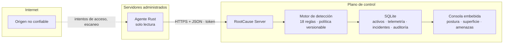

# RootCause Server

```text
╔═══════════════════════════════════════════════════════════════════════════════════╗
║                                                                                   ║
║  ██████╗  ██████╗  ██████╗ ████████╗ ██████╗  █████╗ ██╗   ██╗███████╗███████╗    ║
║  ██╔══██╗██╔═══██╗██╔═══██╗╚══██╔══╝██╔════╝ ██╔══██╗██║   ██║██╔════╝██╔════╝    ║
║  ██████╔╝██║   ██║██║   ██║   ██║   ██║      ███████║██║   ██║███████╗█████╗      ║
║  ██╔══██╗██║   ██║██║   ██║   ██║   ██║      ██╔══██║██║   ██║╚════██║██╔══╝      ║
║  ██║  ██║╚██████╔╝╚██████╔╝   ██║   ╚██████╗ ██║  ██║╚██████╔╝███████║███████╗    ║
║  ╚═╝  ╚═╝ ╚═════╝  ╚═════╝   ╚═╝    ╚═════╝ ╚═╝  ╚═╝ ╚═════╝╚══════╝╚══════╝      ║
║                                                                                   ║
║                             S E R V E R                                           ║
║          Defensa del servidor y de la red que lo rodea · Rust · v0.2.0            ║
╚═══════════════════════════════════════════════════════════════════════════════════╝
```

[](https://github.com/vladimiracunadev-create/rootcause-server/actions/workflows/ci.yml)
[](https://github.com/vladimiracunadev-create/rootcause-server/actions/workflows/security.yml)
[](https://github.com/vladimiracunadev-create/rootcause-server/actions/workflows/codeql.yml)
[](LICENSE)
[](rust-toolchain.toml)
[](docs/CROSS_PLATFORM.md)
[](docs/DETECCION_AMENAZAS.md)
[](docs/POLITICA_DE_PRIVACIDAD_LOCAL.md)
[](CHANGELOG.md)

🌐 **[Página del producto →](https://vladimiracunadev-create.github.io/rootcause-server/)**
· 📘 **[Manual de operación →](docs/MANUAL_USUARIO.md)**
· 🛡️ **[Qué detecta hoy, amenaza por amenaza →](docs/DETECCION_AMENAZAS.md)**

---

**RootCause Server es el hermano de servidor de
[rootcause-windows-inspector](https://github.com/vladimiracunadev-create/rootcause-windows-inspector),
[rootcause-macos-inspector](https://github.com/vladimiracunadev-create/rootcause-macos-inspector),
[rootcause-web-inspector](https://github.com/vladimiracunadev-create/rootcause-web-inspector)
y [rootcause-bitcoin-defense](https://github.com/vladimiracunadev-create/rootcause-bitcoin-defense):**
un plano de control escrito en Rust que vigila **el servidor y la red que lo
rodea**, y explica cada hallazgo con evidencia recuperable.

Hereda la misma razón de existir, llevada al lugar donde el síntoma llega
disperso. **Tu servidor ya escribe registros.** PHP tiene el suyo. La base de
datos tiene el suyo. El sistema operativo tiene el suyo. Cada uno ve su parte y
ninguno ve la frase completa:

> un puerto de base de datos publicado en `0.0.0.0`, una ráfaga de intentos de
> acceso desde una sola dirección y, veinte minutos después, una sesión
> concedida a esa misma dirección.

Ninguno de esos tres registros, por separado, es un incidente. Los tres juntos,
sí. **RootCause Server no reimplementa lo que ya existe: correlaciona lo que
nadie está mirando junto y lo dice en una frase que se puede accionar.**

> **Diagnóstico primero. Intervención después.**

Es un **sensor de apoyo a la decisión**, no un antivirus ni un firewall: no
bloquea direcciones por su cuenta, no edita configuraciones y no reemplaza a tu
EDR. Detecta el origen del riesgo, lo explica con evidencia y deja el runbook
—con el comando exacto y cómo se revierte—. Ejecutarlo es siempre una decisión
humana.

---

## Qué detecta hoy

**18 reglas** publicadas por el propio binario (`rootcause-server rules`), cada
una con la pregunta operativa que responde y su técnica MITRE ATT&CK. La lista
completa y honesta está en [`docs/DETECCION_AMENAZAS.md`](docs/DETECCION_AMENAZAS.md).

| Familia | Lo que vigila | Ejemplos de hallazgo |
|---|---|---|
| **Superficie expuesta** | Qué acepta el equipo desde fuera de sí mismo | PostgreSQL alcanzable en `0.0.0.0:5432`; Telnet publicado |
| **Intrusión** | Quién está empujando contra la puerta | Ráfaga desde un origen; barrido de usuarios; **acceso concedido tras la ráfaga**; salida de datos fuera de su línea base |
| **Integridad** | Lo que decide quién entra | `sshd_config` cambió sin despliegue; `sudoers` quedó escribible por cualquiera |
| **Higiene** | Controles que deberían estar antes de todo | Firewall del host inactivo; parches de seguridad pendientes; reloj desincronizado |
| **Disponibilidad** | El sensor mismo | El agente dejó de reportar — se investiga como manipulación hasta demostrar lo contrario |
| **Recursos** | Saturación, con memoria | CPU al límite **varias muestras seguidas**; disco proyectado a llenarse en horas |

La distinción que ordena todo el panel: **la misma base de datos en
`127.0.0.1` es rutina y en `0.0.0.0` es una emergencia.** El alcance multiplica
el riesgo intrínseco del servicio, y el rol declarado del equipo
(`--label role=edge|internal|database`) cambia qué se considera normal.

### Y lo que no detecta

Un producto de seguridad que no publica sus límites no es honesto. Lo que este
build **no** hace está en [`docs/CAPABILITIES.md`](docs/CAPABILITIES.md):
sin inspección de procesos, sin descubrimiento de red activo, sin RBAC, sin
multi-tenencia, sin alta disponibilidad. La consola muestra siempre las
**superficies que no se pudieron inspeccionar**, para que una puntuación alta
sobre un servidor sin inspeccionar nunca se lea como un certificado de salud.

---

## Arquitectura



El agente **observa y reporta**: no bloquea, no edita configuraciones y solo
ejecuta comandos de una lista blanca de solo lectura con tiempo límite
(`ss`, `netstat`, `journalctl`, `wevtutil`, `ufw`, `netsh`…). Lo que no puede
inspeccionar lo declara como brecha, nunca como cero.

Detalles en [`docs/ARCHITECTURE.md`](docs/ARCHITECTURE.md).

---

## Inicio rápido

### Requisitos

- Rust `1.95.0` o superior (`rust-toolchain.toml` lo fija por ti).
- Windows 10/11 o Server, una distribución Linux con systemd, o macOS.

### 1. Generar un token

```bash
cargo run -p rootcause-server -- token
```

### 2. Levantar el plano de control

```bash
export ROOTCAUSE_API_TOKEN="pega-aqui-el-token"
cargo run -p rootcause-server -- serve
```

En PowerShell:

```powershell
$env:ROOTCAUSE_API_TOKEN = "pega-aqui-el-token"
cargo run -p rootcause-server -- serve
```

La consola queda en `http://127.0.0.1:8080`. **Escucha solo en loopback por
omisión**, y si la cambias te lo advierte en su propio panel.

### 3. Enrolar el primer servidor

```bash
cargo run -p rootcause-agent -- --once --label role=edge --label environment=production
```

Para dejarlo reportando cada 30 segundos, quita `--once`. Antes de enrolar nada,
puedes ver **exactamente** qué se enviaría:

```bash
cargo run -p rootcause-agent -- --dry-run
```

---

## Comandos

```text
rootcause-server token                 # genera un token de alta entropía
rootcause-server rules                 # imprime el catálogo de 18 reglas
rootcause-server policy                # imprime la política vigente, lista para versionar
rootcause-server policy --file p.json  # valida una política antes de usarla
rootcause-server serve --bind 127.0.0.1:8080

rootcause-agent --once                 # un ciclo y sale
rootcause-agent --dry-run              # imprime el sobre sin enviarlo
rootcause-agent --metrics-only         # sin superficie de seguridad
rootcause-agent --watch-file /srv/app/.env
```

Cada opción tiene su variable de entorno equivalente; ver `.env.example`.

---

## Uso remoto seguro

El servidor escucha solo en `127.0.0.1`. Para administrar equipos remotos:

1. Ponlo detrás de Caddy, Nginx, Traefik o un balanceador **con TLS**.
2. Cambia `ROOTCAUSE_BIND` **solo después** de proteger la ruta.
3. Activa `--trust-forwarded-for` **únicamente** si hay un proxy inverso
   delante; sin él, cualquiera elegiría qué dirección se limita y se bloquea.
   El servidor rechaza esa combinación si detecta que escucha en loopback.
4. Instala el agente con una URL `https://`. Si le das una URL `http://` remota,
   se niega a enviar el token salvo que lo autorices de forma deliberada.

El propio plano de control se defiende: **límite de tasa por dirección y bloqueo
tras fallos de autenticación repetidos, evaluados antes de comparar el token.**
Ver [`docs/HARDENING.md`](docs/HARDENING.md).

---

## API

```text
GET  /healthz                          # público
GET  /readyz                           # público, comprueba el almacenamiento
GET  /api/v1/status                    # postura, cifras y endurecimiento
GET  /api/v1/rules                     # catálogo de reglas con su mapeo ATT&CK
GET  /api/v1/policy                    # política de detección vigente
GET  /api/v1/assets                    # inventario con postura por equipo
GET  /api/v1/assets/{id}               # detalle, incidentes e historial
GET  /api/v1/exposure                  # superficie expuesta de toda la flota
GET  /api/v1/threats                   # orígenes que presionan la autenticación
GET  /api/v1/incidents?category=&status=&severity=
GET  /api/v1/incidents/{id}/runbook    # respuesta guiada, nunca ejecutada
GET  /api/v1/topology                  # zonas: Internet, expuesto, interno
GET  /api/v1/audit                     # quién cambió qué
GET  /api/v1/export                    # paquete de evidencia NDJSON
GET  /metrics                          # exposición Prometheus
```

Contrato completo en [`docs/API.md`](docs/API.md).

---

## Desarrollo

```bash
cargo fmt --all -- --check
cargo clippy --workspace --all-targets -- -D warnings
cargo test --workspace
bash scripts/smoke.sh              # servidor y agente reales, extremo a extremo
python3 scripts/guard_console.py   # la consola no puede ganar script en línea
python3 scripts/guard_claims.py    # los números de los documentos salen del código
python3 scripts/guard_encoding.py  # UTF-8 sin BOM, sin CRLF, sin mojibake
```

El modo de desarrollo sin token (`--insecure-dev-mode`) solo funciona en
loopback y existe exclusivamente para eso.

### Lo que CI verifica en cada cambio

Formato · Clippy sin advertencias en los tres sistemas · pruebas en Windows,
Linux y macOS contra la versión mínima **y** la estable · documentación del API
sin advertencias · cobertura con umbral · licencias, orígenes y duplicados
(`cargo deny`) · avisos publicados (`cargo audit`) · la MSRV declarada compila
de verdad · la consola sin script en línea ni origen externo · los números de
los documentos contra el código · `actionlint` y `zizmor` sobre los workflows ·
Markdown · integridad de codificación · `hadolint` y análisis de la imagen ·
una prueba de humo
que levanta el servidor y el agente de verdad. Un trabajo final falla si
**cualquiera** de esos controles no llegó a ejecutarse.

---

## Documentación

- [Manual de operación](docs/MANUAL_USUARIO.md) — qué es cada cosa, en claro
- [Qué detecta, amenaza por amenaza](docs/DETECCION_AMENAZAS.md)
- [Matriz de capacidades y límites](docs/CAPABILITIES.md)
- [Endurecimiento del despliegue](docs/HARDENING.md)
- [Arquitectura](docs/ARCHITECTURE.md)
- [Contrato del API](docs/API.md)
- [Instalación multiplataforma](docs/INSTALLATION.md)
- [Modelo de amenazas](docs/THREAT_MODEL.md)
- [Requisitos de seguridad](docs/SECURITY_REQUIREMENTS.md)
- [Política de privacidad local](docs/POLITICA_DE_PRIVACIDAD_LOCAL.md)
- [Hoja de ruta](docs/ROADMAP.md)
- [Prompt maestro](docs/MASTER_PROMPT.md)

---

## La familia RootCause

| Repositorio | Superficie |
|---|---|
| [rootcause-windows-inspector](https://github.com/vladimiracunadev-create/rootcause-windows-inspector) | Estación Windows |
| [rootcause-macos-inspector](https://github.com/vladimiracunadev-create/rootcause-macos-inspector) | Estación macOS |
| [rootcause-web-inspector](https://github.com/vladimiracunadev-create/rootcause-web-inspector) | Navegador |
| [rootcause-mobile-inspector](https://github.com/vladimiracunadev-create/rootcause-mobile-inspector) | Android e iOS |
| [rootcause-qr-inspector](https://github.com/vladimiracunadev-create/rootcause-qr-inspector) | Códigos QR |
| [rootcause-bitcoin-defense](https://github.com/vladimiracunadev-create/rootcause-bitcoin-defense) | Custodia Bitcoin |
| [rootcause-blockchain-security](https://github.com/vladimiracunadev-create/rootcause-blockchain-security) | Contratos y puentes |
| **rootcause-server** | **El servidor y su red** |

---

## Licencia

[MIT](LICENSE)
