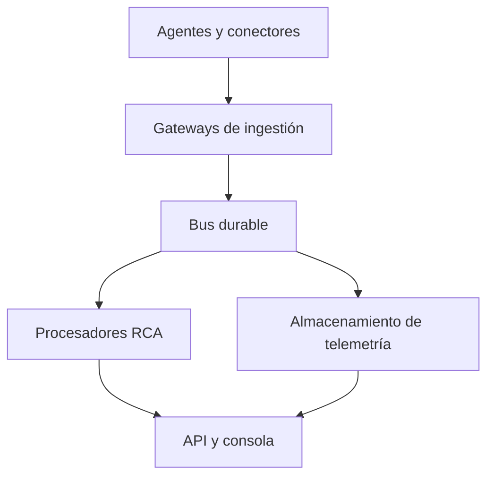

# Arquitectura

## Objetivo

RootCause Server es un plano central de observabilidad y diagnóstico. Recibe
señales de equipos heterogéneos, construye un inventario, correlaciona cambios y
presenta una explicación verificable de la causa raíz.

## Componentes actuales

### `rootcause-core`

Contratos versionados y lógica portable:

- Activos y plataformas.
- Muestras de métricas.
- Incidentes, severidad, evidencia y confianza.
- Topología.
- Reglas deterministas del motor RCA.

No contiene red, almacenamiento ni código dependiente del sistema operativo.

### `rootcause-server`

- API HTTP con Axum/Tokio.
- Autenticación bearer.
- Persistencia SQLite mediante SQLx.
- Deduplicación de incidentes por huella estable.
- Topología derivada de activos e incidentes.
- Consola estática embebida dentro del binario.
- Auditoría inicial de cambios de estado.

### `rootcause-agent`

- Binario nativo de sólo lectura.
- Recopila información con `sysinfo`.
- Identificador estable derivado del host, plataforma y arquitectura.
- Transporte HTTPS mediante rustls.
- Rechaza HTTP remoto salvo autorización explícita.
- Reintento con backoff limitado.

## Flujo de datos

1. El agente registra identidad y metadatos del equipo.
2. Recopila una muestra acotada de recursos.
3. Envía el sobre de telemetría con versión de protocolo.
4. El servidor valida tamaño, versión, identidad y rangos.
5. Persiste la muestra y actualiza el estado del activo.
6. El motor RCA produce cero o más candidatos con evidencia.
7. Los candidatos se insertan o actualizan mediante una huella estable.
8. La consola consulta estado, activos, incidentes y topología.

## Decisiones importantes

- SQLite es el almacenamiento de nodo único para `0.1`. PostgreSQL y ClickHouse
  corresponden a la fase de alta escala.
- El servidor no captura paquetes ni inspecciona el kernel.
- La IA futura no puede inventar evidencias ni ejecutar acciones sin política.
- La consola usa la misma API pública que otras integraciones.
- El agente recopila sólo lo necesario; procesos y archivos se incorporarán
  mediante capacidades explícitas y configurables.

## Escala futura

La siguiente arquitectura mantiene el contrato del agente:

El paso a una arquitectura distribuida exige idempotencia, particionado por
organización, control de retención, colas muertas, backpressure, alta
disponibilidad y pruebas de recuperación.
