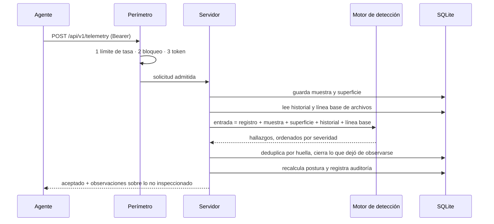

# Arquitectura

## Tres piezas y una regla

```text
crates/
  rootcause-core     dominio y detección  ·  sin I/O, sin reloj propio, sin red
  rootcause-agent    sensor de solo lectura en cada servidor
  rootcause-server   plano de control, API y consola embebida
console/             la consola, compilada dentro del binario del servidor
```

La regla que sostiene todo: **`rootcause-core` no toca el mundo**. No abre
sockets, no lee archivos y no consulta el reloj salvo cuando el llamador se lo
entrega. Dadas la misma entrada y la misma política, produce exactamente la
misma salida.

Eso es lo que hace que un incidente sea reproducible meses después en vez de
meramente plausible: la evidencia se guarda tal como llegó, y una regla nueva
puede volver a evaluarla sin pedirle nada a la flota.

## El ciclo completo



### Por qué el perímetro va antes del token

Una comparación de credencial que ocurre antes del límite de tasa es un oráculo
gratis para quien esté adivinando: mide el tiempo de respuesta y aprende. Aquí
el orden es límite de tasa → bloqueo → comparación en tiempo constante, y está
cubierto por pruebas de integración sobre el router real.

## El agente

Un ciclo produce dos cosas: una muestra de recursos y una superficie de
seguridad.

```text
collector.rs   orquesta el ciclo
net.rs         sockets y conexiones — un parser puro por formato de salida
authlog.rs     eventos de autenticación — agregados antes de salir del host
integrity.rs   huellas SHA-256 de los archivos vigilados
baseline.rs    firewall y parches pendientes
probe.rs       la única puerta a un comando externo
```

`probe.rs` es deliberadamente el único lugar del agente que ejecuta algo. Su
lista blanca es de solo lectura, cada invocación tiene tiempo límite y ningún
argumento proviene de entrada no confiable. La afirmación «el agente no modifica
el host» se puede comprobar leyendo un archivo.

Cada formato de salida —`ss`, `netstat` de Windows, `netstat` BSD,
`/proc/net/*`, `journalctl`, `wevtutil`, `ufw`, `netsh`— tiene su parser puro con
fixtures reales. La parte arriesgada, interpretar texto escrito por la
herramienta de otra persona, se verifica en cada build y en los tres sistemas.

### Brechas, no ceros

Cuando el agente no puede inspeccionar algo, lo declara:

```json
{ "surface": "auth-events", "reason": "wevtutil no pudo leer el registro de seguridad (código 5)" }
```

Esa brecha viaja hasta la puntuación de postura y hasta la consola. Un servidor
sin inspeccionar y un servidor limpio no pueden verse igual.

## El motor de detección

```text
detect/
  mod.rs           catálogo publicado, entrada, motor, fusión por huella
  exposure.rs      qué se alcanza desde fuera
  intrusion.rs     quién empuja: ráfagas, barridos, campañas, salida anómala
  integrity.rs     qué cambió en disco
  hygiene.rs       controles de base
  availability.rs  silencio del sensor (corre en el servidor)
  resource.rs      saturación con ventana temporal
```

Cada regla produce un `IncidentCandidate` con huella estable, evidencia,
confianza declarada, acciones y runbook. El motor los ordena por severidad y
**fusiona los que comparten huella en el mismo ciclo**: un servicio enlazado a
`0.0.0.0` y a `::` es un hallazgo, no dos, y sin esa fusión el contador de
ocurrencias avanzaría dos veces por ciclo haciendo leer una condición estable
como una escalada.

### Política

Todos los umbrales viven en `policy.rs`, son serializables y se validan al
arrancar. Una política cuyos números se contradicen —un umbral alto por encima
del crítico, cero muestras sostenidas— se rechaza en el arranque: una política
que no puede dispararse es peor que ninguna, porque parece defensa.

## El servidor

```text
config.rs     contrato de línea de comandos y entorno, con validación
auth.rs       perímetro y credencial, en ese orden
defense.rs    cubo de fichas y bloqueo por dirección, en memoria
headers.rs    cabeceras de seguridad de toda respuesta
api.rs        rutas y agregaciones
storage.rs    SQLite: activos, telemetría, superficie, incidentes, auditoría
watchdog.rs   silencio, retención y limpieza del perímetro
ui.rs         la consola, servida desde dentro del binario
```

El estado del perímetro es **en memoria a propósito**: tiene que sobrevivir una
ráfaga, no un reinicio, y un reinicio es justo cuando un operador quiere partir
de cero.

### Almacenamiento

SQLite con WAL y migraciones. Las tablas guardan las columnas por las que la
consola filtra **y** el JSON original tal como llegó. Esa duplicación es
deliberada: las columnas sirven para consultar, el JSON para volver a evaluar.

Las migraciones son aditivas (`0002_security_surface.sql` solo añade columnas
con valor por omisión), de modo que una base creada por `0.1` sigue funcionando
tras la actualización.

### Cierre automático

Los hallazgos de superficie e higiene describen un **estado actual**. Cuando un
ciclo deja de reportar la condición, el incidente se cierra solo y el cierre
queda en la auditoría con su motivo. Los de intrusión e integridad no se cierran
solos: describen algo que ocurrió, y eso no deja de haber ocurrido.

## La consola

Vive en `console/` y se compila dentro del binario con `rust-embed`. No hay
directorio de recursos que configurar mal, no hay recorrido de rutas que
defender y no hay CDN en la cadena de confianza.

Se sirve con una CSP sin `unsafe-inline`, y por eso todo su árbol se construye
con la API del DOM: un nombre de equipo reportado por un agente no puede
convertirse en marcado. `scripts/guard_console.py` lo comprueba en cada build.

## Límites conocidos

- **Un solo nodo.** SQLite y el estado del perímetro en memoria no se comparten
  entre instancias.
- **Un token para toda la flota.** La identidad individual por agente y mTLS
  están en la hoja de ruta; hasta entonces, un agente comprometido entrega el
  token de todos.
- **Sin correlación entre equipos.** Cada hallazgo pertenece a un activo.
- **Sin ingesta de registros de aplicación.** RootCause cubre la superficie del
  sistema; PHP, Nginx y la base de datos siguen siendo su propia fuente.
